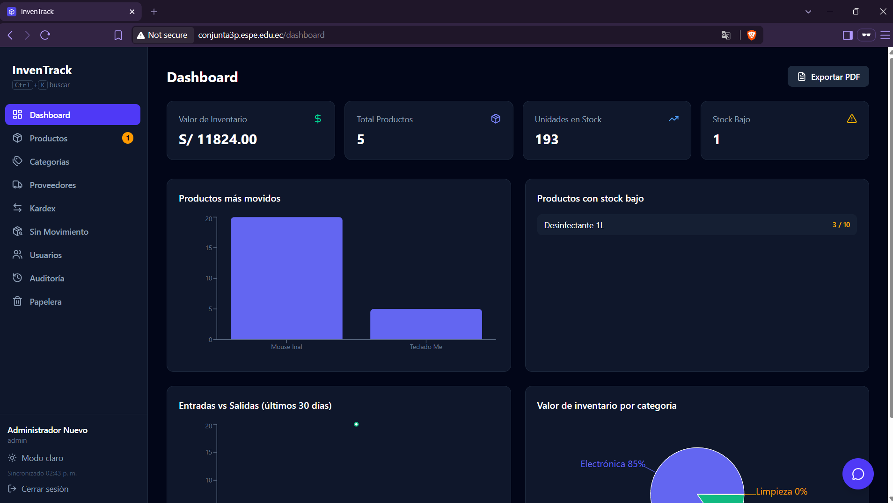
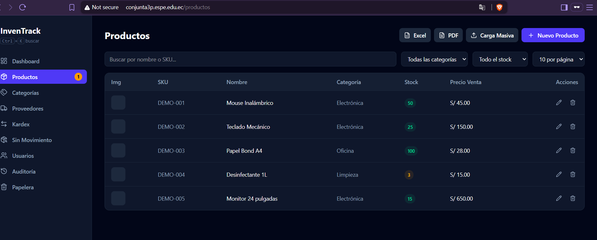
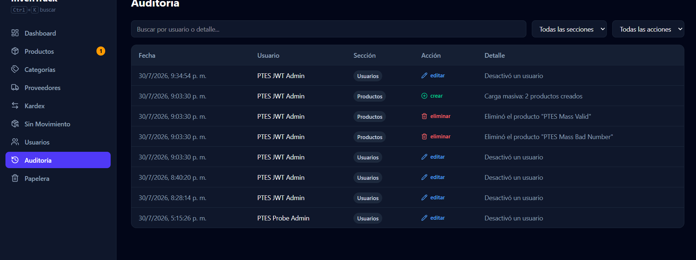
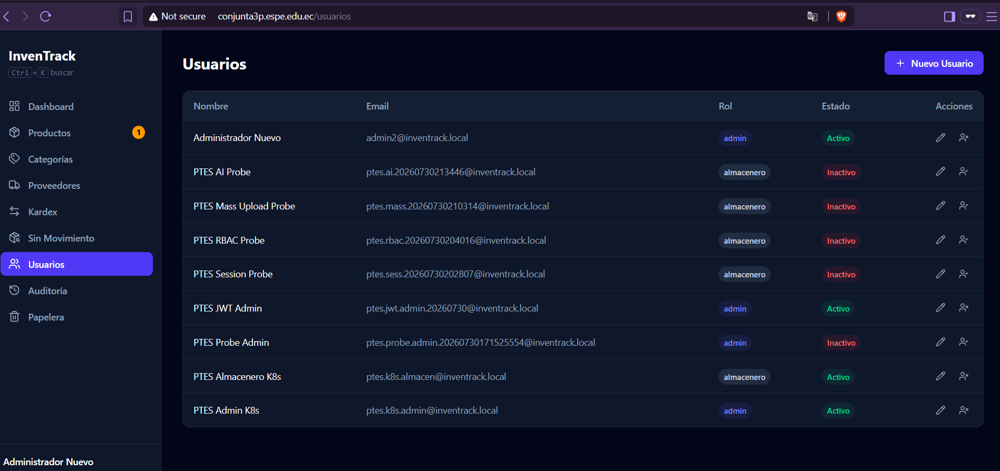

# InvenTrack - Informe PTES en LaTeX

Repositorio del informe técnico final de la práctica de Desarrollo Seguro:
Docker, Kubernetes con Minikube, Ingress y siete fases PTES.

Autor: Gabriel Murillo  
Institución: Universidad de las Fuerzas Armadas ESPE  
Periodo: ESPE VII SI 2026

## Estructura

- `main.tex`: documento principal.
- `preambulo.tex`: estilos, tipografía, colores y bloques `tcolorbox`.
- `secciones/`: capítulos incorporados mediante `\input`.
- `anexos/`: mapa completo de evidencias y repositorios.
- `evidencias/`: salidas técnicas, análisis y capturas.
- `scripts/`: conversión del informe y generación del mapa.
- `output/pdf/`: PDF final compilado.

## Compilación

```powershell
powershell -ExecutionPolicy Bypass -File .\build.ps1
```

El PDF queda en:

`output/pdf/INFORME_FINAL_INVENTRACK_PTES.pdf`

## Cuenta administrativa de laboratorio

Para validar las funciones protegidas de InvenTrack se creó una cuenta adicional con rol `admin`:

- Nombre: `Administrador Nuevo`.
- Correo: `admin2@inventrack.local`.
- Rol: `admin`.
- Contraseña: definida únicamente durante la creación y no almacenada en este repositorio.

La cuenta se creó mediante `POST /api/auth/register`. En el estado actual de la aplicación, este endpoint acepta el rol enviado en el cuerpo de la solicitud. Este procedimiento se utiliza exclusivamente para el laboratorio autorizado; en producción, el registro público no debería permitir asignar el rol `admin`.

### Reproducir la creación con otra contraseña

Ejecutar desde WSL Ubuntu con el dominio resuelto al Minikube local. El siguiente procedimiento solicita la contraseña sin mostrarla ni guardarla en el historial:

```bash
TARGET_URL="http://conjunta3p.espe.edu.ec"
ADMIN_EMAIL="admin.repro@inventrack.local"

read -rsp 'Nueva contraseña del administrador: ' ADMIN_PASSWORD
echo

body="$(jq -n \
  --arg nombre "Administrador de laboratorio" \
  --arg email "$ADMIN_EMAIL" \
  --arg password "$ADMIN_PASSWORD" \
  '{nombre: $nombre, email: $email, password: $password, rol: "admin"}')"

curl --fail-with-body -sS \
  -X POST \
  -H 'Content-Type: application/json' \
  --data "$body" \
  "$TARGET_URL/api/auth/register"

unset ADMIN_PASSWORD body
```

El correo debe ser único y la contraseña debe tener al menos ocho caracteres. Para confirmar el resultado, iniciar sesión desde `http://conjunta3p.espe.edu.ec/` y verificar que el perfil muestre el rol `admin`.

### Evidencia visual



*Figura 1. Dashboard accesible con la cuenta administrativa nueva.*



*Figura 2. Consulta del inventario y los productos de demostración.*



*Figura 3. Acceso administrativo al registro de auditoría.*



*Figura 4. Usuario `admin2@inventrack.local` activo y asociado al rol `admin`.*

## Repositorios relacionados

- Kubernetes: <https://github.com/gamurigm/inventrack-k8s>
- Aplicación original: <https://github.com/agcudco/conjunta-desarrollo-seguro>
- Informe y evidencias: <https://github.com/gamurigm/inventrack-ptes-report>
